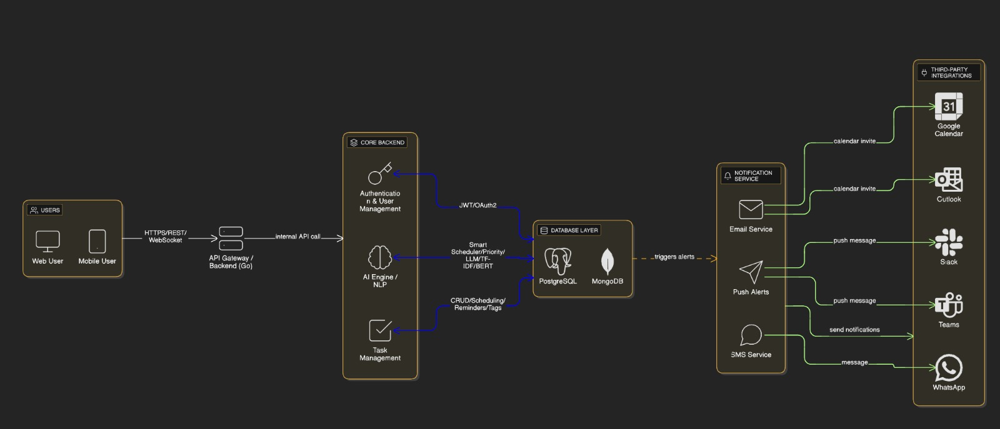

🚀 Smart Task Planner – AI-Powered Task Breakdown System

The Smart Task Planner converts high-level goals (e.g., “Launch a SaaS landing page in 2 weeks”) into a structured, execution-ready plan — including actionable tasks, dependencies, and time estimates.
This solution demonstrates real-world backend engineering using Spring Boot, structured API design, LLM-based reasoning, and optional persistence & frontend rendering.

🎯 Objective

The assignment objective is to:

Break user goals into actionable tasks with timelines using AI reasoning, delivered through a backend API and optional frontend UI.

📌 Referencing the assignment specification:

Input: goal text → Output: stepwise plan

Backend API to generate structured plan using LLM

Optional DB + frontend

Evaluation criteria → timeline logic, task completeness, clean API design, reasoning clarity

🧠 Key Features
Feature	Description	Status
AI Reasoning to break down goals	Converts abstract goal → clear tasks

REST API built with Spring Boot	/api/generate-plan endpoint	

Structured JSON response format	Includes dependencies & duration	

Optional database integration	MongoDB / PostgreSQL persistence	

Minimal React UI frontend	Accepts goal & displays tasks	

Error & fallback handling	Critical error flow supported	

Unit tests using MockMvc & JUnit	Controller + validation testing	

🏗 System Architecture
High-Level Component Diagram

Uploaded separately in repo under

🔁 Flow Summary
React UI → POST request to Spring Boot API → LLM reasoning call → Generated plan → Save to DB (optional) → Response displayed to UI

🔧 Tech Stack
Layer	Technology
Frontend	React, Axios, TailwindCSS
Backend	Spring Boot 3.x, Java 17
LLM API	OpenAI / Local LLM
Database	MongoDB / PostgreSQL
Build & Deployment	Maven, Docker, Railway / Render
Testing	JUnit5, MockMvc, Postman
📡 Complete API Design
Base URL
http://localhost:8080/api

POST /generate-plan

Generate AI-based structured task plan.

📤 Request

{
  "goal": "Launch a SaaS landing page",
  "targetDuration": "14 days"
}

📥 Response

{
  "planId": "665f1b3f8fae4b1e9cf11a23",
  "goal": "Launch a SaaS landing page",
  "targetDuration": "14 days",
  "tasks": [
    {
      "id": 1,
      "task": "Research competitors",
      "description": "Analyze 5 similar landing pages",
      "duration": "1 day",
      "dependsOn": null
    },
    {
      "id": 2,
      "task": "Create UI wireframes",
      "duration": "2 days",
      "dependsOn": 1
    }
  ],
  "createdAt": "2025-12-09T10:20:15Z"
}

📛 Error Response Format

{
  "timestamp": "...",
  "status": 400,
  "error": "Bad Request",
  "message": "goal must not be blank"
}

Additional Endpoints (optional)
Method	Endpoint	Purpose
GET	/plans	List saved plans
GET	/plans/{id}	Fetch specific plan
DELETE	/plans/{id}	Delete plan
GET	/health	Status check
🧪 Testing
Postman / curl
curl -X POST http://localhost:8080/api/generate-plan \
-H "Content-Type: application/json" \
-d '{"goal":"Launch portfolio site","targetDuration":"7 days"}'

JUnit + MockMvc
mockMvc.perform(post("/api/generate-plan")
        .contentType(MediaType.APPLICATION_JSON)
        .content(objectMapper.writeValueAsString(request)))
        .andExpect(status().isOk())
        .andExpect(jsonPath("$.tasks").isArray());

🎨 React Frontend 

Input fields for goal & timeline

Submit button → API POST

Task result cards UI

Loading & error handling

A generation prompt for UI code has been included in development artifacts.

📈 Future Enhancements
Enhancement	Status
Gantt chart / timeline visualization	Planned
User authentication + JWT	Planned
Multiple goal dashboard	Planned
Real-time progress tracking	Planned
📽 Demo Video (To be uploaded)

Recording includes:

Architecture overview

API testing in Postman

UI → backend → response flow

Explanation of reasoning & design choices

👤 Author & Contact

Himanshu kumar
📍 Punjab, India
📧 himu2486@gmail.com
